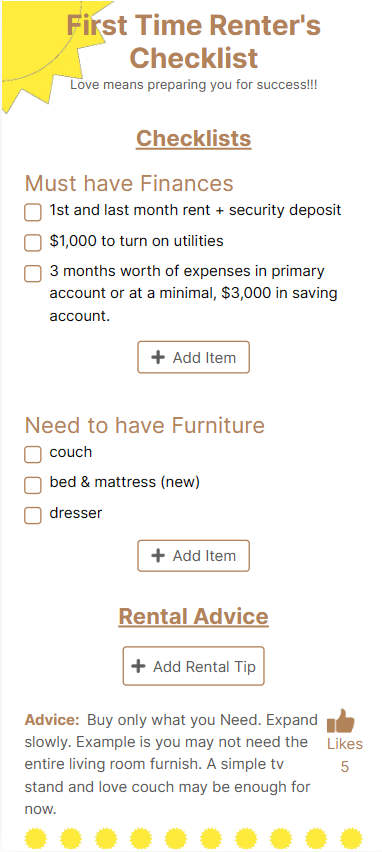

# First Time Renter's Checklist
_"Love means preparing you for success"_

An innovative application designed to assist young adults in transitioning to new homes by providing guidance from supportive individuals with checklists and advice. 

## Features
1. An outline of essential financial considerations prior to relocating, with the option for users to offer additional suggestions.
2. An inventory of necessary furniture items for individuals moving into their first residence, with the option for users to provide additional suggestions.
3. Guidelines for first time renters, with the option for users to share additional advice and indicate agreement with a thumbs up.

## Backend
The backend is located in a seperate repo, https://github.com/jcsmileyjr/checklist. It's a Java & Springboot application that connects an H2 database using Hibernate with a Spring Boot API to the frontend. 

## Built with
- **Next.js** is a frontend JavaScript framework, based on React but with server components/actions, used for displaying the user interface. 
- **TailwindCSS** is a CSS library utilized to quickly style the application. 

## Get Started
1. Clone the repo
2. In the terminal for the renters-ui directory, type "npm install" to install the libraries.
3. In the terminal, type "npm run dev"

## Author
- Website - [JC Smiley](https://www.jcsmileyjr.com)
- Twitter - [@JCSmiley4](https://twitter.com/JCSmiley4)
- LinkedIn - [jcsmileyjr](https://www.linkedin.com/in/jcsmileyjr/)
